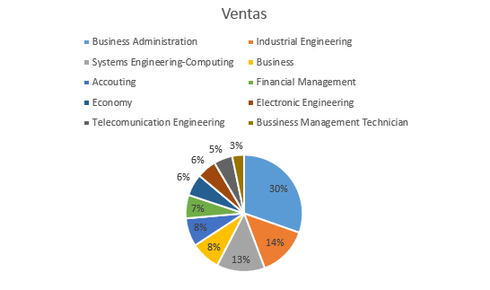

In this article, I’m gonna show what are the most popular jobs in Colombia, regarding different bases to develop this article. for example; The DANE made senses at the national level to reach the figures; PULZO took the most demanded jobs and with the highest labor offer for its analysis. This jobs took as the citizens think that have a higher salary and the foreigns analyze the stats around the country to decide that this.

From the rode in the text, the most popular or common jobs in Colombia are: 

1.  Business Administration
2.	Industrial engineering
3.	Systems engineering - computing
4.	Business administration
5.	Accounting
6.	Financial management
7.	Economy
8.	Electronic engineering
9.	Telecommunications engineering
10.	Business management technician

All these were taken because they are the most requested, demanded and well-paid jobs at the national level. They were selected because different statistical analyzes are the works that people usually choose to study at the University to have a promising future.

In my opinion, I’m taking the last table, the ideal job in Colombia is Industrial Engineering,  because is a career that with multiple fields in which you can exercise, additionally, Colombia is a big industrial sector.